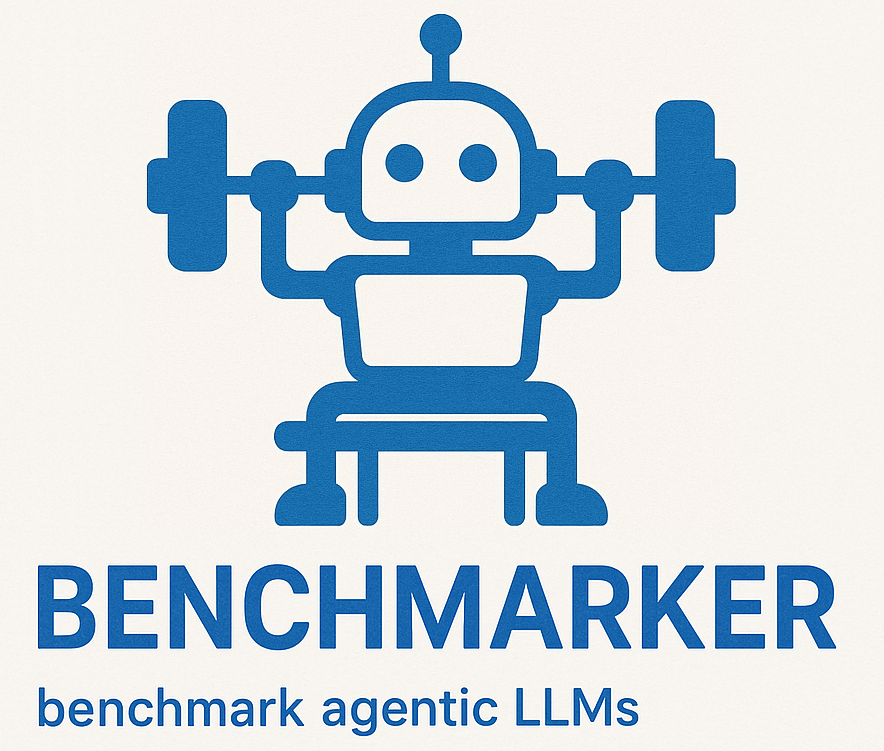

# Benchmarker

**Benchmarker** is a simple yet powerful CLI tool for benchmarking LLMs and agentic workflows. It allows you to evaluate language models and execution strategies against custom datasets and scoring rules, making it ideal for LLM research, product evaluations, and performance regressions.

Benchmarker is a Python-based command-line tool that:

- Loads benchmark **suites** defined in YAML  
- Runs model **scenarios** using configurable **strategies**  
- Scores model responses using a judge model or logic-based scorer  
- Generates rich output reports and saves detailed traces  
- **NEW**: Supports image OCR and handwriting recognition testing

Built with modularity in mind, Benchmarker supports multiple providers, models, scoring strategies, prompt styles, and now **multimodal capabilities** — making it a flexible backbone for comprehensive LLM evaluations.

## 💡 Why?

When working with LLMs, we often face a fundamental decision-making problem:

> _Should I use a powerful model with simple one-shot prompting? Or a lighter-weight model in a multi-agent setup?_

This question comes up constantly, whether you’re building small apps, experimenting with new strategies, or running model comparisons. Choosing which model, which prompting strategy, or how to structure agent interactions often becomes guesswork.

Even flagship models behave differently depending on:
* Prompting style (one-shot vs few-shot vs programmatic)
* Strategy (direct call vs agent collaboration)
* Model type (high-parameter “thinking” models like GPT-4-Turbo vs faster lightweight variants like GPT-4o)

There wasn’t a simple way to experiment systematically, measure tradeoffs, and decide with data.

So I built Benchmarker.

## ⚙️ Setup

### VS Code Dev Container Setup (Recommended)

The easiest way to get started with all dependencies pre-configured:

1. **Open in VS Code**: Clone the repository and open it in VS Code
2. **Open as Dev Container**: When prompted, select "Reopen in Container" - this will automatically build a Docker environment with all dependencies including Python, poppler for PDF processing, and all required libraries
3. **Configure credentials**: Copy the environment template and add your API credentials
   ```bash
   cp .env.template .env
   # Edit .env with your actual Azure OpenAI credentials
   ```

That's it! The dev container handles all the setup automatically.

## ⚙️ Run

### 1. Edit the suite (Q&A suite)

```bash
# Edit the suite file
nano data/suites/basic.yaml
```

```yaml
suite:
  name: "Simple Q&A Benchmark"
  description: "Configuration for running simple Q&A benchmark with Azure OpenAI"

  dataset: "data/datasets/basic.yaml"

  scenarios:
    - name: "qa_test_azure_oneshot"
      strategy: "direct_prompt"
      provider: "azure_openai"

  scoring:
    name: "scoring judge"
    strategy: "llm_judge"
    provider: "azure_openai"
    max_score: 10
    prompt: |
      You are evaluating the quality of an answer to a factual question.

      Question: {question}
      Expected Answer: {expected_answer}
      Actual Answer: {response}

      Rate the answer on a scale of 0-10 where:
      - 10: Perfect, accurate answer
      - 8-9: Mostly correct with minor issues
      - 6-7: Partially correct
      - 4-5: Some relevant information but mostly incorrect
      - 0-3: Completely wrong or irrelevant

      Respond with a JSON object containing 'score' (number) and 'explanation' (string).
    scoring:
      - "Factual accuracy"
      - "Completeness of answer"
      - "Clarity and coherence"

  output:
    path: "data/results/qa_evaluation.json"

  providers:
    azure_openai:
      type: azure_openai
      endpoint: ${ENDPOINT}
      api_version: ${API_VERSION}
      api_key: ${API_KEY}
      deployment: ${DEPLOYMENT}
      model: ${MODEL}
```

```bash
# Edit the dataset file
nano data/datasets/basic.yaml
```

```yaml
dataset:
  name: "Simple Q&A Dataset"
  description: "Basic factual questions for capability assessment"
  version: "1.0"

  questions:
    - id: "geo_001"
      prompt: "What is the capital of France?"
      expected: "Paris"
      category: "geography"
      difficulty: "easy"

    - id: "sci_001"
      prompt: "What is the chemical symbol for gold?"
      expected: "Au"
      category: "science"
      difficulty: "easy"
```

### 2. Run the benchmark

```bash
python -m app run data/suites/basic.yaml
```

### 3. View the results
- Results will be saved to `data/results/qa_evaluation.json`
- Console will display a summary table with scores, latency, and status

## How to Contribute

We welcome contributions from the community! To get started:
	1.	Fork the repo
	2.	Create a feature branch: git checkout -b feature/my-feature
	3.	Make your changes and write tests if applicable
	4.	Run benchmarks or linters to verify your update
	5.	Submit a pull request with a clear description

If you’re not sure where to start, check out our Issues page.

## Next Steps

Here’s a preview of what’s coming next or areas where you can contribute:
 - 🤖 AutoGen support: Add native support for AutoGen-style multi-agent evaluation
 - 🧠 Include larger & SOTA datasets: Add benchmarks like GSM8K, ARC, MMLU
 - 📚 Support RAG benchmarks: Benchmark retrieval-augmented pipelines via synthetic queries or hybrid eval
 - 🔧 Fine-tuning integration: Evaluate checkpoints pre/post fine-tuning on key tasks

Want to lead one of these features? Open an issue or propose a draft!


## License

MIT License. See LICENSE for details.